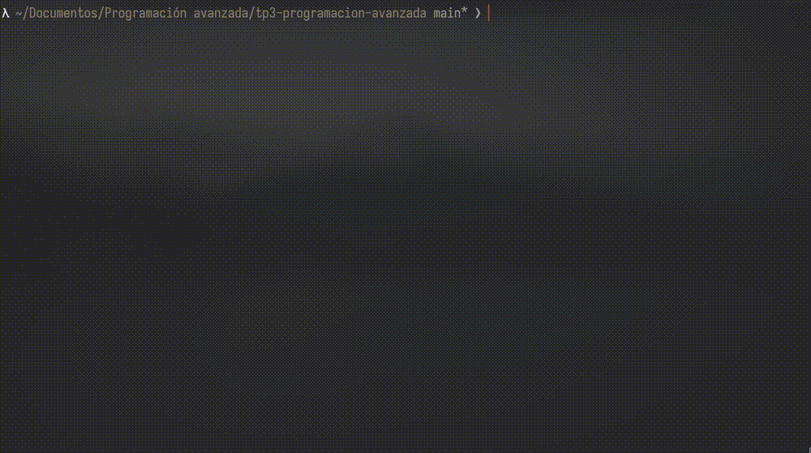
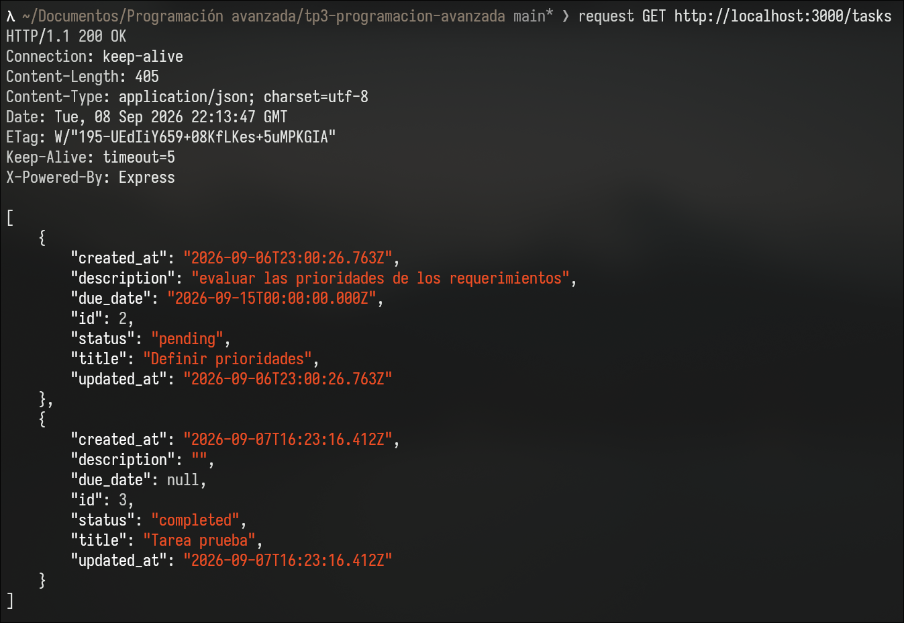
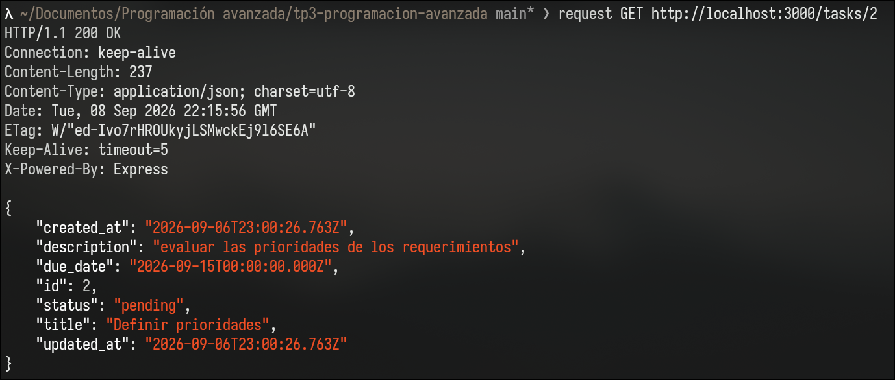
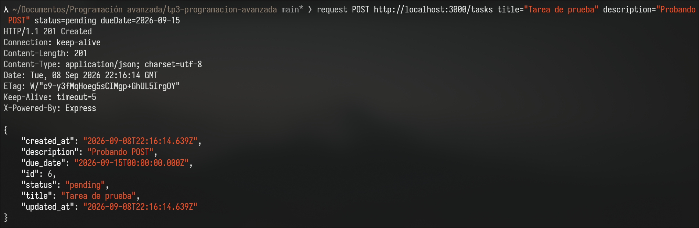
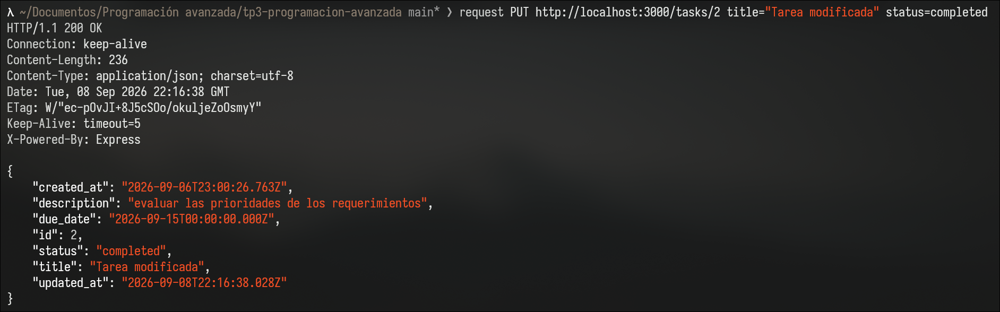
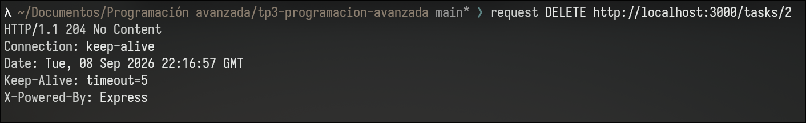
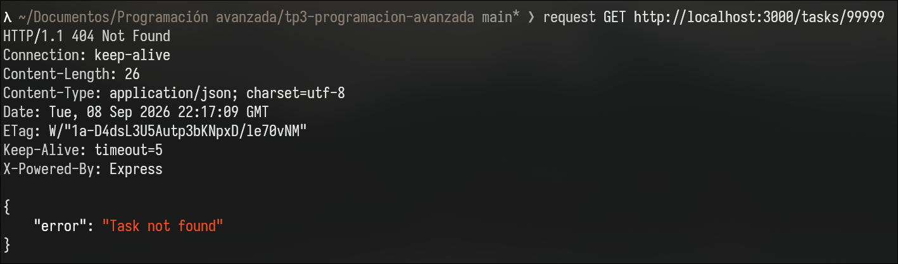

# TP3 - Programación Avanzada

API REST para la gestión de tareas, desarrollada con Node.js, Express y PostgreSQL, utilizando Docker y Docker Compose para levantar los servicios.

## Tecnologías utilizadas

- Node.js
- Express
- PostgreSQL
- Docker
- Docker Compose

## Endpoints

| Método | Endpoint     | Descripción                  |
| ------ | ------------ | ---------------------------- |
| GET    | `/tasks`     | Obtiene todas las tareas     |
| GET    | `/tasks/:id` | Obtiene una tarea por su ID  |
| POST   | `/tasks`     | Crea una nueva tarea         |
| PUT    | `/tasks/:id` | Modifica una tarea existente |
| DELETE | `/tasks/:id` | Elimina una tarea            |

## Docker Compose

En el siguiente GIF se muestra el proyecto funcionando con Docker Compose:



## Pruebas de los endpoints

Las pruebas fueron realizadas utilizando `curl`.

### GET - Obtener todas las tareas

```bash
curl http://localhost:3000/tasks
```



### GET - Obtener tarea por ID

```bash
curl http://localhost:3000/tasks/1
```



### POST - Crear una tarea

```bash
curl -X POST http://localhost:3000/tasks \
  -H "Content-Type: application/json" \
  -d '{"title":"Tarea de prueba","description":"Probando POST","status":"pending","dueDate":"2026-09-15"}'
```



### PUT - Modificar una tarea

```bash
curl -X PUT http://localhost:3000/tasks/1 \
  -H "Content-Type: application/json" \
  -d '{"title":"Tarea modificada","status":"completed"}'
```



### DELETE - Eliminar una tarea

```bash
curl -X DELETE http://localhost:3000/tasks/1
```



## Prueba de error 404

También se probó el comportamiento de la API al solicitar una tarea que no existe.

```bash
curl http://localhost:3000/tasks/99999
```

La API devuelve un código de estado `404` indicando que la tarea no fue encontrada.



## Prueba de persistencia

Para comprobar la persistencia de los datos se realizó el siguiente procedimiento.

Primero se creó una tarea mediante un `POST` y se verificó que la tarea se guardara correctamente en la base de datos.

Luego se reinició solamente el contenedor del backend:

```bash
docker compose restart backend
```

Después del reinicio se volvió a consultar la lista de tareas y se comprobó que la tarea creada seguía existiendo.

Esto sucede porque reiniciar el contenedor `backend` no elimina los datos almacenados en PostgreSQL. La base de datos utiliza un volumen de Docker, por lo que los datos permanecen aunque el contenedor de la API sea reiniciado.

Luego se ejecutó:

```bash
docker compose down -v
```

y se volvió a levantar el proyecto:

```bash
docker compose up -d
```

Al consultar nuevamente las tareas, la tarea creada anteriormente ya no existía.

Esto ocurre porque la opción `-v` elimina los volúmenes asociados al proyecto. Al eliminar el volumen de PostgreSQL también se eliminan los datos que estaban almacenados en él.

### Informe

En esta prueba se comprobó qué pasa con los datos de la base de datos cuando se reinician los contenedores.

Primero creé una tarea nueva mediante un POST y verifiqué que se había guardado correctamente. Después reinicié solamente el contenedor `backend` con `docker compose restart backend`. Al volver a consultar las tareas, la tarea que había creado seguía existiendo. Esto se debe a que al reiniciar el contenedor `backend` no se elimina la información de la base de datos, ya que los datos de PostgreSQL están guardados en un volumen de Docker.

Luego ejecuté `docker compose down -v` y volví a levantar el proyecto. En este caso, la tarea ya no estaba. Esto pasó porque la opción `-v` elimina los volúmenes asociados al proyecto, incluyendo el volumen donde PostgreSQL guardaba los datos.

Con esta prueba pude comprobar que reiniciar un contenedor no borra los datos, mientras que eliminar el volumen sí provoca que se pierda la información almacenada en la base de datos.
